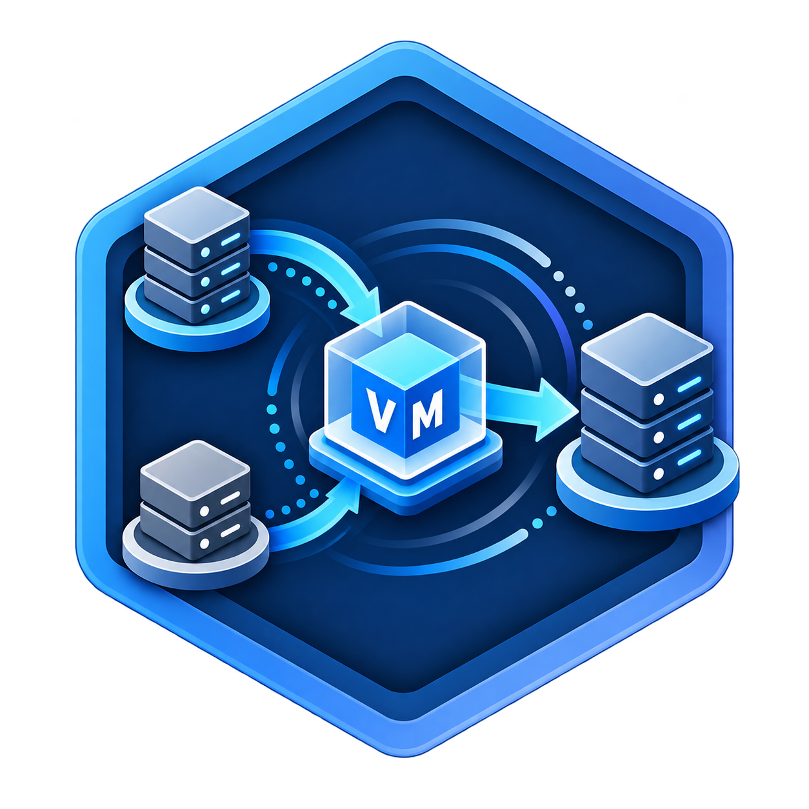

<p align="center">
  
</p>

# VMTO — VM Transfer Orchestrator

> **版本：** `v0.3.0-preview.2`  
> **授權：** MIT License

企業級虛擬機遷移編排工具。目前可運作的生產路徑是 **vSphere → Proxmox VE**（含 mock）。**Hyper-V → Proxmox VE** 仍在 Phase 13：13a 做通用 Source/Target 與 plan-driven Saga，13b 才是真 Windows agent 與開機驗證。請勿把現有 Hyper-V UI / mock client 當成 MVP 完成。

---

## 📢 最新版本更新日誌 (Changelog - v0.3.0-preview.2)

本預覽版本包含重大的架構演進、全離線 16 碼企業授權、現代化毛玻璃/新擬態視覺升級、NeuSelect 自定義下拉選單與全站互動體驗最佳化：

### 🌟 核心新功能與架構演進
- **Phase 13a 通用多平台遷移架構 (ADR-006 ~ 018)**：
  - 引進來源／目標平台隔離抽象介面（`IVmSourcePort`、`IVmTargetPort`）與 `PlatformKind`。
  - 實作動態遷移計畫建構器（`MigrationPlanBuilder`）與計畫驅動之 MassTransit Saga，修復歷史流程綁定問題。
  - 支援目標全量自動回滾（`IVmTargetPort.RollbackAsync`）與來源暫存清理機制。
- **純離線 16 碼商業授權系統 (ADR-019)**：
  - 支援在無網際網路連線（Air-Gapped）之機房環境，透過 16 碼 Crockford Base32 格式（`XXXX-XXXX-XXXX-XXXX`）搭配 48-bit HMAC-SHA256 數位簽章即時離線啟用。
  - 內嵌版權方案（Standard / Enterprise）、並行任務上限、有效期限與功能模組旗標。
- **NeuSelect 毛玻璃新擬態下拉選單（`NeuSelect.vue`）**：
  - 徹底替換瀏覽器 OS 原生灰色 `<select>`，打造專屬浮動快顯選單（Floating Popover Menu）。
  - 具備新擬態凹陷微浮雕觸發框、動態 180° 旋轉箭頭指示器、毛玻璃（`backdrop-filter: blur(24px)`）背景與柔和懸浮陰影。
  - 支援選項 Hover 漸層高亮、已選項目打勾（`✓`）與專屬圖示（如 🇹🇼/🇺🇸、🌐/🪟/⚡）。
  - 支援 Click-Outside 點擊外部自動收合與鍵盤方向鍵導航（A11y）。
  - 全面套用至連線管理（平台類型）、設定（語言切換）、新增任務（來源/目標連線、VM 選單、儲存庫、策略、格式）與稽核日誌（分頁筆數）。
- **全新現代化 Glassmorphism & Neumorphism 前端設計**：
  - 全新六角立體科技感 VM 遷移 Logo（支援 Favicon、登入頁、側邊欄及文檔）。
  - **認證佈局隔離（Auth Layout Isolation）**：未登入與登入頁面完全隱藏側邊欄與上方導覽，呈現純淨毛玻璃登入卡。
  - **動態迷你側邊欄（Dynamic Mini-Sidebar）**：支援 76px 簡約圖示模式與 260px 展開模式，具備 Hover 懸停動態展開與圖釘（📌）固定切換。
  - **通知抽屜互動升級**：支援透明毛玻璃 Backdrop 遮罩、Click-Outside 點擊外部任意處自動關閉、專屬關閉按鈕與 `Esc` 鍵快捷退出。
  - **狀態感知授權管理介面（State-Aware License UX）**：直觀呈現已啟用方案、遮罩序號（`5526-••••-••••-48cc`）、並行配額，並提供折疊式續約/更換序號按鈕。
- **語系與功能精簡優化**：
  - 全面清除簡體中文（`zh-CN`），專注提供高品質繁體中文（`zh-TW`，預設）與英文（`en-US`）。
  - 徹底移除未使用的 Webhooks 模組，大幅精簡系統架構與後端負擔。
- **全套品質與自動化測試保證**：
  - 通過 **203 個**後端單元與整合測試（含 PostgreSQL 真實容器測試）。
  - 通過 Playwright 跨主題、跨解析度之端對端瀏覽器自動化驗證。

---

## 架構總覽

VMTO 採用 **Clean Architecture + DDD (Domain-Driven Design)** 分層設計，搭配 **Event-driven** 架構處理長時間非同步遷移任務：

- **Domain 層**：聚合根（MigrationJob、Connection、Artifact、License）、由 Source × Target × Options 衍生的 Migration Plan、值物件、領域事件
- **Application 層**：CQRS 命令 / 查詢、DTO、來源／目標 Port（13a 將現有 `ISourcePlatformPort` 鷹架對齊 plan 契約）
- **Infrastructure 層**：EF Core 持久化、vSphere / PVE 客戶端、Hyper-V mock／未來 mTLS agent、S3 儲存、加密服務
- **API 層**：ASP.NET Core Minimal API，提供 REST 端點與 SignalR 即時推送
- **Worker 層**：MassTransit 消費者 + Saga。13a 必須改成依 plan snapshot 推進，不得再寫死 `ExportVhdx`
- **詞彙**：見根目錄 [`CONTEXT.md`](CONTEXT.md)

### C4 Level 1 — System Context

```
                    ┌─────────────┐
                    │   使用者     │
                    │  (瀏覽器)    │
                    └──────┬──────┘
                           │ HTTPS
                           ▼
                    ┌─────────────┐
                    │    VMTO     │
                    │   System    │
                    └──┬───┬───┬──┘
                       │   │   │
            ┌──────────┘   │   └──────────┐
            ▼              ▼              ▼
     ┌────────────┐ ┌────────────┐ ┌────────────┐
     │  vSphere   │ │ Proxmox VE │ │  Storage   │
     │  (來源)    │ │  (目標)    │ │ (MinIO/S3) │
     └────────────┘ └────────────┘ └────────────┘
```

### C4 Level 2 — Container Diagram

```
┌──────────────────────────────────────────────────────────────┐
│                        VMTO System                           │
│                                                              │
│  ┌───────────┐    ┌───────────┐    ┌───────────────────┐     │
│  │  Frontend  │───▶│  API      │◀──▶│   PostgreSQL      │     │
│  │  (Vue 3)  │    │ (ASP.NET) │    │   (持久化)        │     │
│  │  :5173    │    │  :5000    │    └───────────────────┘     │
│  └───────────┘    └─────┬─────┘                              │
│                    SignalR│                                    │
│                         │                                    │
│                    ┌────▼─────┐    ┌───────────────────┐     │
│                    │ RabbitMQ │◀──▶│   Worker           │     │
│                    │ (訊息)   │    │ (MassTransit Saga) │     │
│                    │  :5672   │    └─────┬─────────────┘     │
│                    └──────────┘          │                    │
│                                         ▼                    │
│  ┌───────────┐    ┌──────────┐    ┌───────────────────┐     │
│  │   Redis   │    │ Hangfire │    │   MinIO (S3)      │     │
│  │  (快取)   │    │ (排程)   │    │   (產物儲存)      │     │
│  │  :6379    │    └──────────┘    │   :9000           │     │
│  └───────────┘                    └───────────────────┘     │
└──────────────────────────────────────────────────────────────┘
```

---

## 技術棧

| 類別 | 技術 |
|------|------|
| **Backend** | .NET 10, ASP.NET Core Minimal API, Entity Framework Core, MassTransit + RabbitMQ, Hangfire |
| **Frontend** | Vue 3 + TypeScript + Vite, Pinia, Vue Router, SignalR Client |
| **資料庫** | PostgreSQL 17, Redis 7 |
| **儲存** | MinIO (S3 相容), Ceph (可選) |
| **Observability** | OpenTelemetry, Serilog, Prometheus, Jaeger, Grafana |
| **部署** | Docker Compose, Kubernetes (Helm Chart), KEDA |

---

## 快速開始

### 前置需求

- [.NET 10 SDK](https://dotnet.microsoft.com/download)
- [Node.js 22+](https://nodejs.org/) 與 npm
- [Docker](https://www.docker.com/) 與 Docker Compose

### 1. 啟動基礎設施

```bash
cd infra
cp .env.example .env   # 編輯 .env 調整密碼等設定
docker compose up -d   # 啟動 PostgreSQL, Redis, RabbitMQ, MinIO
```

### 2. 啟動 API

```bash
dotnet run --project src/VMTO.API
```

### 3. 啟動 Worker

```bash
dotnet run --project src/VMTO.Worker
```

### 4. 啟動前端

```bash
cd frontend
npm install
npm run dev
```

### 5. 存取服務

| 服務 | 網址 |
|------|------|
| 前端 | http://localhost:5173 |
| API / Swagger | http://localhost:5000/swagger |
| Health Check | http://localhost:5000/health |
| Hangfire Dashboard | http://localhost:5000/hangfire (開發模式) |
| RabbitMQ Management | http://localhost:15672 |
| MinIO Console | http://localhost:9001 |
| Prometheus | http://localhost:9090 |
| Grafana | http://localhost:3000 |
| Jaeger | http://localhost:16686 |

---

## 目前狀態（2026-08-28）

| 階段 | 狀態 | 真實含義 |
| --- | --- | --- |
| Phase 1–12 | 完成 | 含可觀測性、韌性、前端 UX、Ops API |
| Phase 13a | 進行中 | 通用 Source/Target、`PlatformKind`、plan-driven Saga、修 vSphere 回歸、文件說實話。Hyper-V 維持 mock |
| Phase 13b | 未開始 | 單機 Hyper-V host 上的 mTLS agent、全碟離線匯出、轉檔、PVE 開機、Target rollback |
| Phase 14 | 未開始 | 真 vSphere + 真 Hyper-V 試點。不加第三個 Platform |

現有 Hyper-V 程式（Port、`ExportVhdx` consumer、UI pre-flight）是**鷹架**，不是 MVP。已知回歸：`MigrationJobSaga` 在 `JobStarted` 一律發 `ExportVhdxMessage`，會弄斷 vSphere。細節見 [`plan.md`](plan.md)、[`Tasks.md`](Tasks.md)、[`CONTEXT.md`](CONTEXT.md)。

---

## 歷史完成能力（Phase 12）

- **E4 前端體驗升級完成**
  - 深色模式（含 ECharts dark theme 同步）
  - PWA（Service Worker、離線回退頁、可安裝）
  - 行動裝置適配（Sidebar 抽屜、表格卡片化、底部導覽）
  - 通知中心（鈴鐺 badge、Toast、歷史抽屜、已讀管理）
- **E5 營運自動化完成**
  - 自癒掃描與卡住任務修復（Hangfire recurring jobs）
  - Ops API（health-report / stuck-jobs / storage-usage / system-info / backup / restore）
  - KEDA ScaledObject（RabbitMQ queue depth 擴縮 Worker）
  - 每日資料庫備份至 MinIO + 災難復原手冊

---

## Ops API 端點總覽

| 類型 | 端點 |
|------|------|
| DLQ | `GET /api/ops/dlq`、`POST /api/ops/dlq/{id}/replay` |
| Chaos 控制 | `GET /api/ops/chaos`、`POST /api/ops/chaos` |
| 維運報表 | `GET /api/ops/health-report`、`GET /api/ops/storage-usage`、`GET /api/ops/system-info` |
| 自癒修復 | `GET /api/ops/stuck-jobs`、`POST /api/ops/stuck-jobs/{id}/heal` |
| 設定備份 | `POST /api/ops/backup/config`、`POST /api/ops/restore/config` |

> 所有 `/api/ops/*` 端點需 Admin 權限。

---

## 專案結構

```
VM-Transfer-Orchestrator/
├── src/
│   ├── VMTO.Shared/            # 共用型別：Result、ErrorCodes、CorrelationId、Telemetry
│   ├── VMTO.Domain/            # 領域層：聚合根、值物件、領域事件、策略模式
│   │   ├── Aggregates/         #   MigrationJob, Connection, Artifact, License
│   │   ├── Enums/              #   JobStatus, StepStatus
│   │   ├── Events/             #   JobCreated, StepCompleted, StepFailed …
│   │   ├── Strategies/         #   FullCopy, Incremental 遷移策略
│   │   └── ValueObjects/       #   EncryptedSecret, Checksum, StorageTarget
│   ├── VMTO.Application/       # 應用層：CQRS 命令 / 查詢、DTO、Port 介面
│   ├── VMTO.Infrastructure/    # 基礎設施層：EF Core、S3、vSphere / PVE 客戶端、加密
│   │   ├── Clients/            #   VSphereClient, PveClient, Mock 版本
│   │   ├── Security/           #   DataProtectionEncryptionService, AuditLog
│   │   ├── Storage/            #   S3StorageAdapter, LocalStorageAdapter
│   │   └── Telemetry/          #   OpenTelemetry 設定
│   ├── VMTO.API/               # API 層：Minimal API 端點、Middleware
│   │   ├── Endpoints/          #   Job, Connection, Artifact, License 端點
│   │   └── Middleware/         #   GlobalExceptionHandler, CorrelationId
│   ├── VMTO.Worker/            # Worker 層：MassTransit 消費者、Saga 編排
│   │   ├── Consumers/          #   ExportVmdk, ConvertDisk, Upload, Import, Verify
│   │   ├── Messages/           #   訊息定義
│   │   └── Sagas/              #   MigrationJobSaga 狀態機
│   └── VMTO.LicenseServer/     # 授權伺服器（獨立服務）
├── tests/
│   ├── VMTO.Domain.Tests/      # 領域層單元測試
│   ├── VMTO.Application.Tests/ # 應用層單元測試
│   ├── VMTO.Infrastructure.Tests/ # 基礎設施層測試
│   └── VMTO.API.Tests/         # API 整合測試
├── frontend/                   # Vue 3 前端應用
├── infra/                      # Docker Compose 與 Dockerfile
├── helm/                       # Kubernetes Helm Chart
├── docs/                       # 文件
│   ├── adr/                    # 架構決策記錄
│   └── openapi.yaml            # OpenAPI 3.0 規格
├── VMTO.sln                    # .NET Solution
└── Directory.Build.props       # 全域建置屬性 (.NET 10, Nullable, WarningsAsErrors)
```

---

## 建置與測試

```bash
# 建置整個方案
dotnet build VMTO.sln

# 執行測試（排除 Integration）
dotnet test VMTO.sln --filter "Category!=Integration"

# 執行單一測試專案
dotnet test tests/VMTO.Domain.Tests

# 前端型別檢查
cd frontend && npm run type-check

# 前端建置
cd frontend && npm run build
```

---

## 部署

### Docker Compose（完整環境）

```bash
cd infra
docker compose -f docker-compose.yml -f docker-compose.build.yml up -d
```

此命令會建置 API、Worker、Frontend 容器並連同基礎設施一起啟動。Worker 預設啟動 2 個副本。

Container Image 預設使用 `version.json` 中的版本號作為 tag。亦可手動指定：

```bash
# 指定版本建置
cd infra && VERSION=0.2.0 ./publish.sh

# 推送到 registry
REGISTRY=ghcr.io/jeff1121 VERSION=0.2.0 ./publish.sh
```

### Kubernetes (Helm)

```bash
helm install vmto helm/ -f helm/values-prod.yaml

# 啟用 KEDA 擴縮
helm upgrade --install vmto helm/ -f helm/values-prod.yaml -f helm/values-keda.yaml
```

Helm Chart 包含 API、Worker、Frontend 的 Deployment/Service，以及可選的 Ingress 與 HPA 設定。詳見 `helm/values.yaml`。

---

## 版本管理

VMTO 採用集中式版本管理，所有元件版本統一由以下檔案控制：

| 元件 | 版本來源 | 說明 |
|------|----------|------|
| .NET Backend | `Directory.Build.props` → `VersionPrefix` | 所有 .NET 組件共用 |
| Frontend | `frontend/package.json` → `version` | npm 版本 |
| Container Images | `version.json` + `docker-compose.build.yml` | OCI Label + Image Tag |
| Helm Chart | `helm/Chart.yaml` → `appVersion` | K8s 部署版本 |
| OpenTelemetry | `ActivitySources.Version` | 從 Assembly Version 自動讀取 |

### 版本號升級流程

1. 更新 `version.json` 中的 `version` 欄位
2. 同步更新 `Directory.Build.props` 的 `VersionPrefix` / `AssemblyVersion` / `FileVersion`
3. 同步更新 `frontend/package.json` 的 `version`
4. 同步更新 `helm/Chart.yaml` 的 `appVersion`
5. 提交並建立 Git Tag：`git tag v0.2.0`

---

## 選型決策記錄 (ADR)

| 編號 | 標題 | 摘要 |
|------|------|------|
| [ADR-001](docs/adr/001-masstransit-rabbitmq.md) | MassTransit + RabbitMQ | 採用 MassTransit 作為訊息匯流排，取代純 Hangfire 方案。支援 Saga 編排、水平擴充、訊息重試與死信佇列。 |
| [ADR-002](docs/adr/002-hangfire-scheduling.md) | Hangfire 輔助排程 | 保留 Hangfire 處理定期清理、增量同步排程等 cron 類任務，與 MassTransit 互補。 |
| [ADR-003](docs/adr/003-minio-default-storage.md) | MinIO 預設儲存 | 選用 MinIO 作為預設物件儲存，S3 相容 API、Docker Compose 自帶、可無縫切換至 Ceph。 |
| [ADR-004](docs/adr/004-dataprotection-encryption.md) | DataProtection 加密 | 使用 ASP.NET DataProtection 加密連線密碼，預留 Vault / KMS 介面。 |
| [ADR-005](docs/adr/005-native-aot-evaluation.md) | Native AOT 評估 | EF Core / MassTransit 暫不走 AOT，維持 JIT。 |
| [ADR-006](docs/adr/006-plan-is-multi-platform-contract.md) | plan.md 是契約 | 現有 Hyper-V 捷徑是鷹架，不是產品形狀。 |
| [ADR-007](docs/adr/007-connection-holds-platform.md) | Connection 持有 Platform | Transport 是設定，不是新 Platform。 |
| [ADR-008](docs/adr/008-phase-13-split.md) | Phase 13 拆 13a / 13b | 架構與真 Hyper-V host 分開交付。 |
| [ADR-009](docs/adr/009-hyperv-mtls-agent.md) | Hyper-V 用 mTLS agent | Linux Worker 不跑 `Export-VM`、不講 WinRM。 |
| [ADR-010](docs/adr/010-hyperv-standalone-host.md) | 一 Connection 一台獨立 host | 叢集 / CSV / SCVMM 範圍外。 |
| [ADR-011](docs/adr/011-plan-is-derived.md) | Plan 由系統衍生 | 操作者不選 named strategy；刪 `HyperVOffline`。 |
| [ADR-012](docs/adr/012-job-migrates-all-selected-disks.md) | 一個 Job 遷一台 VM 的碟 | 13b 多碟在同一 Job。 |
| [ADR-013](docs/adr/013-all-or-nothing-target-rollback.md) | 目標全有或全無 | 失敗 rollback 整台 Target VM。 |
| [ADR-014](docs/adr/014-source-is-never-deleted.md) | 來源永不刪改 | 刪除 `DeleteSourceAfter`。 |
| [ADR-015](docs/adr/015-verify-is-checksum-and-running.md) | 成功 = checksum + running | Guest 健康不是自動閘門。 |
| [ADR-016](docs/adr/016-all-supported-disks.md) | 沒有磁碟 picker | 不支援碟讓整台 VM 不合格。 |
| [ADR-017](docs/adr/017-plan-driven-saga-in-13a.md) | 13a 交付 plan-driven Saga | 不接受只分支 Vmdk/Vhdx 的 hotfix 當架構。 |
| [ADR-018](docs/adr/018-phase-14-is-real-pilot.md) | Phase 14 是真機試點 | 不加 KVM / 叢集 / 增量。 |
| [ADR-019](docs/adr/019-offline-16char-license-key.md) | 16 碼離線授權碼架構 | 採用 Crockford Base32 與 48-bit HMAC-SHA256，支援全離線 Air-Gapped 啟用。 |

---

## 商業授權與版本功能比較

VMTO 支援純離線（Air-Gapped）16 碼授權金鑰（`XXXX-XXXX-XXXX-XXXX`）啟動機制。以下為未授權模式與商業版之完整功能差異：

| 評估維度 | ⚪ 未授權 / 開發者模式 (Unlicensed / Developer Mode) | 🟢 已啟用商業授權 (Standard / Enterprise) |
| :--- | :--- | :--- |
| **並行遷移任務數 (Max Concurrency)** | **嚴格限制 1~2 個任務**。<br>若同時啟動多個任務，系統會拒絕或強制排隊阻塞。 | **解鎖 5 ~ 20+ 個並行任務**（依授權碼內嵌之位元數決定），支援多主機同時大規模平行遷移。 |
| **來源平台支援 (Source Platforms)** | 僅能使用基礎單一來源（如標準 vSphere）。 | **解鎖全平台來源**（含 **Hyper-V 離線匯出**、多硬碟遷移、Pre-flight 深度檢查）。 |
| **增量同步與 CBT (Incremental Replication)** | 僅支援全量複製（Full Copy）；<br>增量策略選項會被鎖定並提示需 Enterprise 授權。 | **解鎖 Changed Block Tracking (CBT)**、Delta 增量鏡像拉取與最終停機切換（Cutover）。 |
| **自癒與維運自動化 (Self-Healing & Ops)** | 僅提供基礎手動重試；<br>背景自癒、自動重試暫時性錯誤為關閉狀態。 | **解鎖生產級自癒機制**（卡住任務自動復原、暫時性網路抖動智慧自動重試、S3 資料庫自動備份）。 |
| **歷史日誌與稽核 (Audit Trail & Export)** | 僅保留基礎即時日誌；<br>不支援 CSV 批次匯出。 | **完整保留全鏈路稽核時間軸**，支援合規 CSV 匯出與永久記錄。 |

---

## 報告文件

| 文件 | 說明 |
|------|------|
| [程式碼審查報告](docs/code-review-report.md) | 全專案 Code Review 結果，含各層評分與改進建議 |
| [安全掃描報告](docs/security-scan-report.md) | OWASP Top 10 安全掃描，含漏洞清單與修復優先級 |
| [增量同步架構](docs/incremental-sync.md) | CBT 增量同步設計文件 |
| [OpenAPI 規格](docs/openapi.yaml) | API 介面規格 |
| [災難復原手冊](docs/disaster-recovery.md) | 備份、還原、復原驗證流程 |
| [領域詞彙](CONTEXT.md) | Source / Target / Platform / Plan 等 ubiquitous language |
| [多平台遷移計畫](plan.md) | Phase 13 契約與 13a / 13b / 14 切線 |

---

## Mock 模式

在沒有真實 vSphere 或 Proxmox VE 環境的情況下，可啟用 Mock 模式執行完整遷移流程：

1. 在 `infra/.env` 中設定 `MOCK_MODE=true`
2. 或在 `appsettings.Development.json` 中設定對應開關

Mock 模式下，`MockVSphereClient`、`MockPveClient` 與 `MockHyperVClient` 會模擬匯出 / 匯入操作。Hyper-V mock **不是** 13b 完成的證據。適合用於：
- 開發與除錯前端 UI
- 測試 Saga 編排流程（13a 修復後，vSphere mock 必須仍能跑通）
- CI/CD 管線驗證
- Demo 展示

---

## 授權

本專案採用 [MIT License](LICENSE) 授權。
